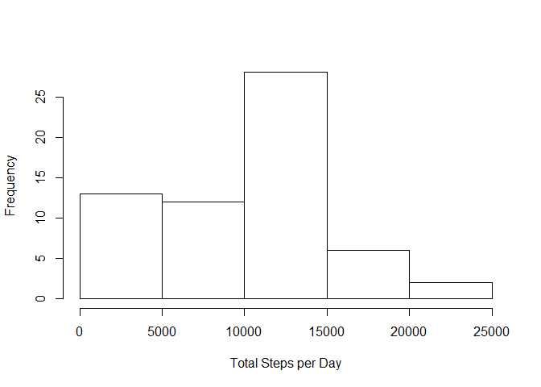

# Reproducible Research: Peer Assessment 1


## Loading and preprocessing the data


```r
library(dplyr)
library(ggplot2)

# Loading and preprocessing the data
activities <- read.csv("./activity.csv")
activitiesByDate <- activities %>% group_by(date)
```

## What is mean total number of steps taken per day?


```r
totalStepsByDate <- activitiesByDate %>% summarise(totalSteps = sum(steps, na.rm = TRUE))
hist(totalStepsByDate$totalSteps, xlab = "Total Steps per Day", main = "")
```

<!-- -->

The mean and median of the total number of steps taken per day are 9354.2295082 and 10395 respectively.

## What is the average daily activity pattern?


```r
# Find average step numbers by the interval
activitiesByInterval <- activities %>% group_by(interval) %>% summarise(averageSteps = mean(steps, na.rm = TRUE))
g <- ggplot(activitiesByInterval, aes(interval, averageSteps))
g + geom_line() + labs(x="Interval", y= "Number of Steps")
```

<!-- -->

```r
# Find the 5-minute interval with the maximum number of steps
intervalWithMaxStepNumber <- activitiesByInterval[activitiesByInterval$averageSteps == max(activitiesByInterval$averageSteps),][1]
```

The 5-minute interval, 835, containing the maximum number of steps, 206.1698113.

## Imputing missing values


```r
# Find total number of missing values in the dataset
totalNACount <- summary(activities$steps)["NA's"]
```

The total number of missing values in the dataset is 2304.


```r
# Fill in all NA's by the mean for that 5-minute interval
activities.NoNA <- activities
for (i in 1:nrow(activities.NoNA)) {
        if(is.na(activities.NoNA[i,]$steps))
                activities.NoNA[i,]$steps <- activitiesByInterval[activitiesByInterval$interval == activities.NoNA[i,]$interval, "averageSteps"][[1]]
}

activitiesByDate.NoNA <- activities.NoNA %>% group_by(date)
totalStepsByDate.NoNA <- activitiesByDate.NoNA %>% summarise(totalSteps = sum(steps, na.rm = TRUE))
hist(totalStepsByDate.NoNA$totalSteps, xlab = "Total Steps per Day", main = "")
```

<!-- -->

The mean and median of the total number of steps taken per day are 1.0766189\times 10^{4} and 1.0766189\times 10^{4} respectively.  Imputing missing data makes the estimates of the total daily number of steps more accurate.

## Are there differences in activity patterns between weekdays and weekends?


```r
activities.NoNA$date <- as.Date(activities.NoNA$date)
activities.NoNA$datCat <- factor((weekdays(activities.NoNA$date) %in% c('Saturday', 'Sunday')), 
                           levels=c(TRUE, FALSE), labels=c('weekend', 'weekday'))

averageStepsByIsWeekendandInterval.NoNA <- activities.NoNA %>% group_by(datCat, interval) %>% summarise(averageSteps = mean(steps, na.rm = TRUE))

g.NoNA <- ggplot(averageStepsByIsWeekendandInterval.NoNA, aes(interval, averageSteps))
g.NoNA + geom_line() + facet_wrap(~datCat, ncol = 1) + labs(x="Interval", y= "Number of Steps")
```

<!-- -->
